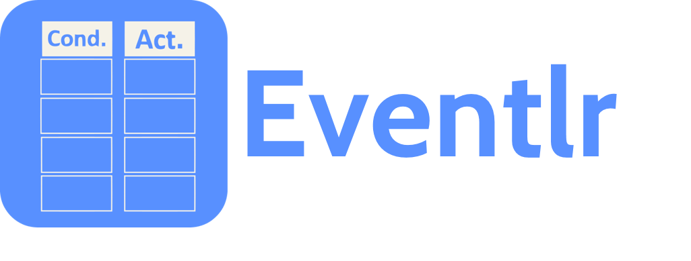

# 

 

Programming made easy for kids, teens, womens, olds, and even the experienced. Eventlr is the app to create apps, with ridiculously-easy visual event sheets with conditions/actions.

Todo: same above description from same source, on git description, start page, C2 project description, README, etc

----

## Contributing

This is a open-source and accessible app, so you're welcome to open a issue (with criticism/suggestions) and open pull requests with improvements.
Please follow our <a href="http://www.contributor-covenant.org/" target="_blank">Code of Conduct</a> before interacting or contributing.

## Todo

## Related links

